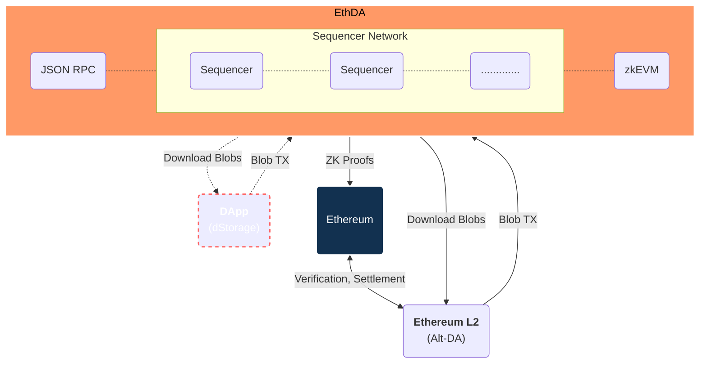

Below is the general data flow between EthDA and L2s using it as Alt-DA.

```mermaid
flowchart TD
    dapp("`**DApp** 
(dStorage)`"):::dappCls -.-> |Blob TX| ethda
    l2("`**Ethereum L2**
    (Alt-DA)`") --> |Blob TX| ethda
    ethda --> |ZK Proofs| ethereum(Ethereum)
    ethda -.-> |Download Blobs| dapp
    ethda --> |Download Blobs| l2
    ethereum:::ethereumCls <--> |Verification, Settlement| l2
    subgraph ethda[EthDA]
        direction LR
        jsonrpc(JSON RPC) -.- sequencerNetwork
        subgraph sequencerNetwork[Sequencer Network]
            direction LR
            ethda_sequencer(Sequencer) -.- ethda_sequencer2(Sequencer)
            ethda_sequencer2 -.- ethda_sequencer3(.............)
            ethda_sequencer3
        end
        sequencerNetwork -.- zkevm(zkEVM)
    end
    ethda:::ethdaCls
    
    classDef ethereumCls fill:#123150,padding:25px,color:#fff,stroke:#fff,stroke-width:2px;
    classDef dappCls stroke:#f66,stroke-width:2px,color:#fff,stroke-dasharray: 5 5;
    classDef ethdaCls fill:#f96,color:#000,stroke:#fff,stroke-width:2px;
```